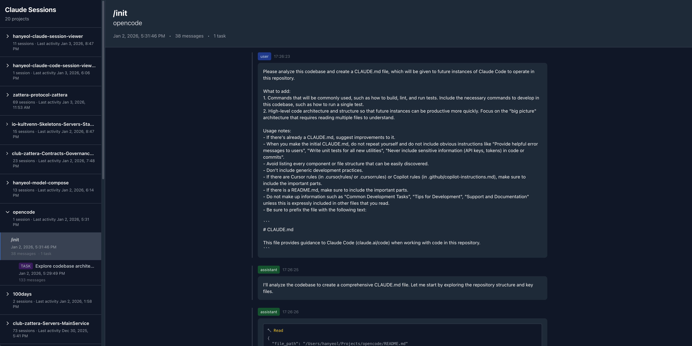

<div align="center">



</div>

# Claude Session Viewer

A web-based tool to visualize Claude session history from your local `.claude` directory in a timeline format.

## Getting Started

### Run with npx

```bash
npx claude-session-viewer
```

After running the command, look for the following logs to find the server URL:

```
Server running on http://localhost:9090
Watching Claude directory: /Users/hanyeol/.claude
```

Open the URL shown in the logs (e.g., `http://localhost:9090`) in your web browser.

### Development

If you want to modify the source code or run in development mode, first install dependencies:

```bash
npm install
```

Then run the development server:

```bash
npm run dev
```

This command runs both:
- Backend server (http://localhost:3000)
- Frontend development server (http://localhost:5173)

Open http://localhost:5173 in your browser.

### Build

```bash
npm run build
```

## Features

- ✅ Auto-detect `.claude` directory
- ✅ Session list by project
- ✅ Session detail timeline view
- ✅ Real-time file change detection (WebSocket)
- 🚧 Search and filtering
- 🚧 Code highlighting
- 🚧 Markdown rendering

## Project Structure

```
.
├── src/
│   ├── server/           # Fastify backend
│   │   └── index.ts
│   ├── components/       # React components
│   │   ├── SessionList.tsx
│   │   └── SessionDetail.tsx
│   ├── App.tsx
│   ├── main.tsx
│   └── index.css
├── vite.config.ts        # Vite config (includes proxy)
└── package.json
```

## API

### GET /api/sessions
Returns a list of all sessions.

### GET /api/sessions/:id
Returns detailed information for a specific session.

### WebSocket /ws
Receives real-time file change events.
